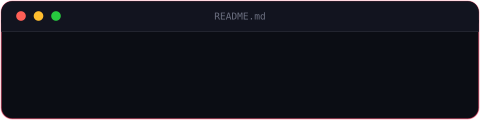

<h1 align="left">Hi 👋, I'm TiuBo</h1>

<blockquote>

<code>&gt;_</code>&nbsp; I am a Computer Science student (specializing in Software Engineering) at <strong>Ho Chi Minh City University of Technology (HCMUT - Bách Khoa)</strong>, passionate about building reliable and scalable software applications. Core to my stack are <code>Java</code>, <code>Spring Boot</code>, <code>React</code>, and modern databases, alongside foundational knowledge of <code>Python</code>, all driven by clean code principles and solid engineering practices.

</blockquote>

  

### Some of my skills

<table>
  <thead>
    <tr>
 <th align="center"><b>  Languages & Frameworks</b></th>
      <th align="center"><b>  Databases & Testing</b></th>
      <th align="center"><b> DevOps & Tooling</b></th>
    </tr>
  </thead>
  <tbody>
    <tr>
      <td align="center" valign="top">
         
        
          
      </td>
      <td align="center" valign="top">
         
        
          
        
          
      </td>
      <td align="center" valign="top">
         
        
          
      </td>
    </tr>
  </tbody>
</table>

 

  <b>IDEs & Environments:</b>&nbsp;
  
  
  

### My projects
<table width="100%">
  <tr>
    <td width="50%" valign="top">
      <b>🔹 Tên dự án 1</b> 
      Mô tả ngắn gọn dự án làm gì, công nghệ sử dụng. 
      <a href="#">🔗 Repo</a>
    </td>
    <td width="50%" valign="top">
      <b>🔹 Tên dự án 2</b> 
      Mô tả ngắn gọn dự án làm gì, công nghệ sử dụng. 
      <a href="#">🔗 Repo</a>
    </td>
  </tr>
</table>

---

### GitHub Stats
<table width="100%">
  <tr>
    <td width="50%" valign="top" align="center">
      
    </td>
    <td width="50%" valign="top" align="center">
      
       
      
    </td>
  </tr>
</table>

---

  

